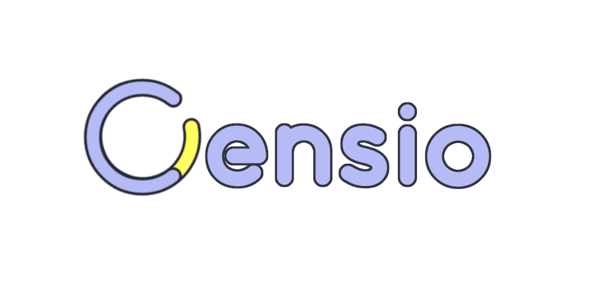
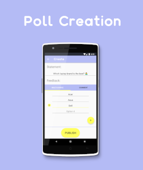

<!-- <a href='https://play.google.com/store/apps/details?id=com.apps.creativesource.censio&pcampaignid=MKT-Other-global-all-co-prtnr-py-PartBadge-Mar2515-1'></a> -->

**Censio is a social networking app that's designed to allow users to ask questions, post statements, or share opinions. Users can decide if they want their posts to receive unrestricted or specific feedback from other users.**

**If users decide to add multi-choice feedback, the percentage of each selected option will be calculated as users interact with the post -giving the user a clear visual representation of it's feedback.**

**The app also allows users to create traditional comment posts, so that others can freely reply and communicate to a post in a simple unrestricted manner.**



## Built With

* [Firebase](https://firebase.google.com/) - *Services:* Firestore, Auth-UI, & Messaging
* [Glide](https://bumptech.github.io/glide/) - Image loading library
* [RadioGroupPlus](https://github.com/worker8/RadioGroupPlus) - Custom radio grouping library
* [CircleImageView](https://github.com/hdodenhof/CircleImageView) - Round image widget library

## License

```
All Rights Reserved
```
